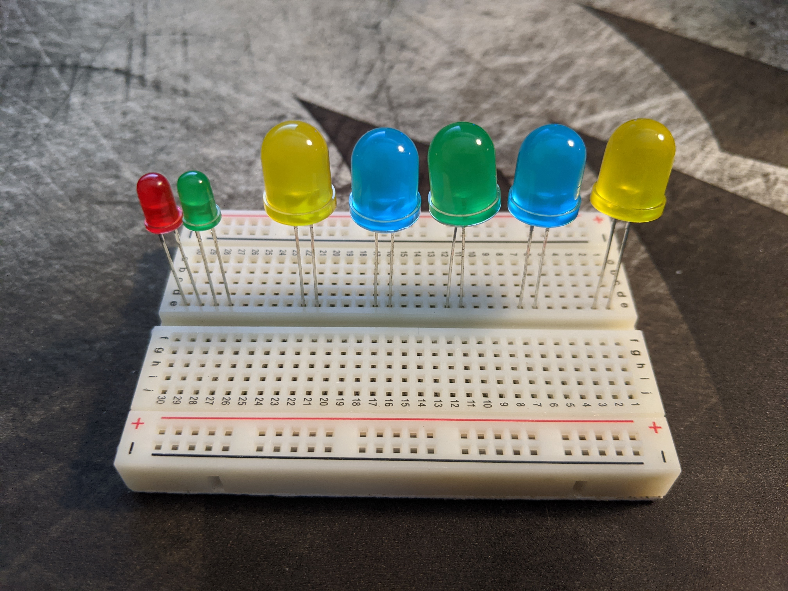
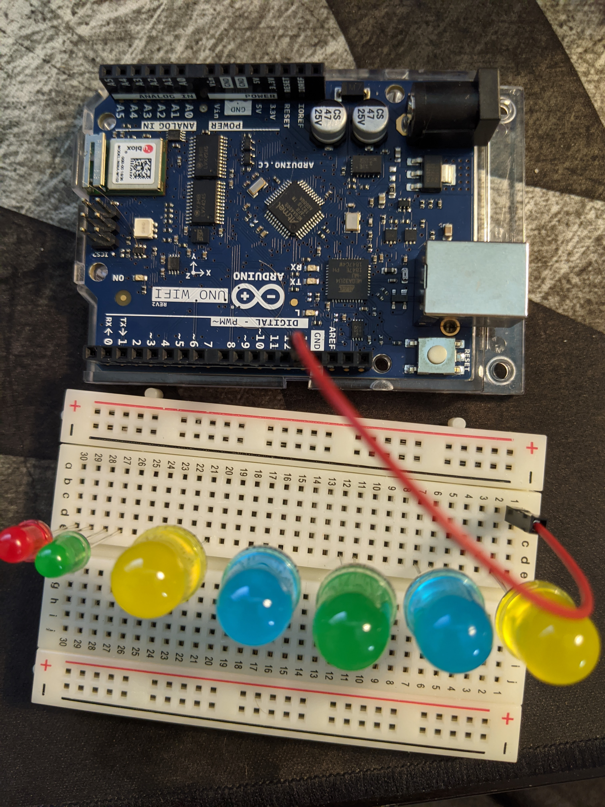
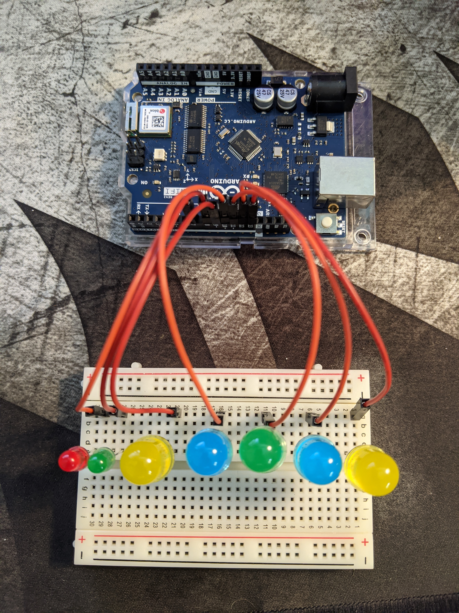
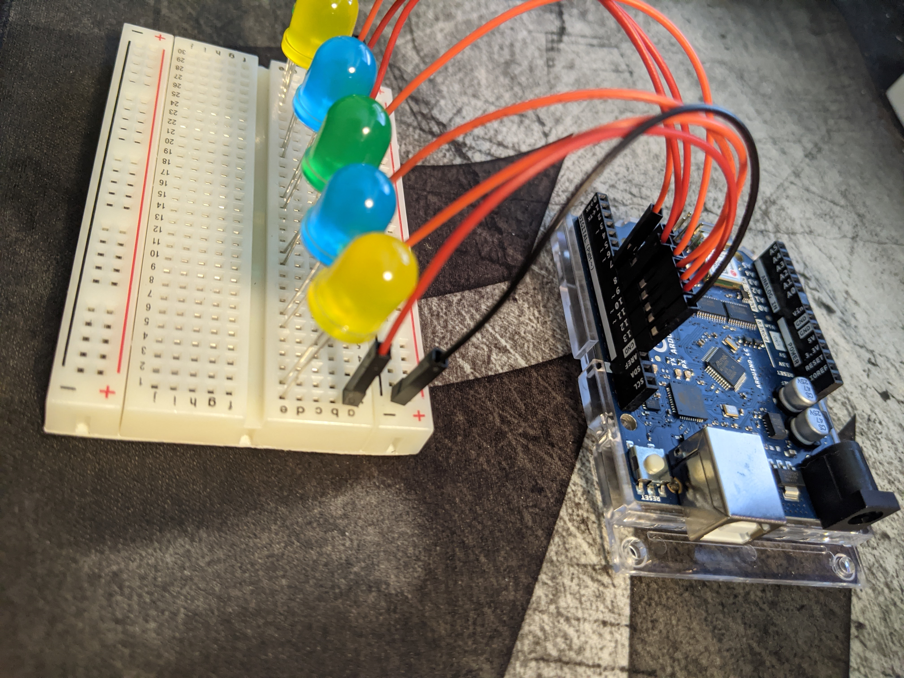
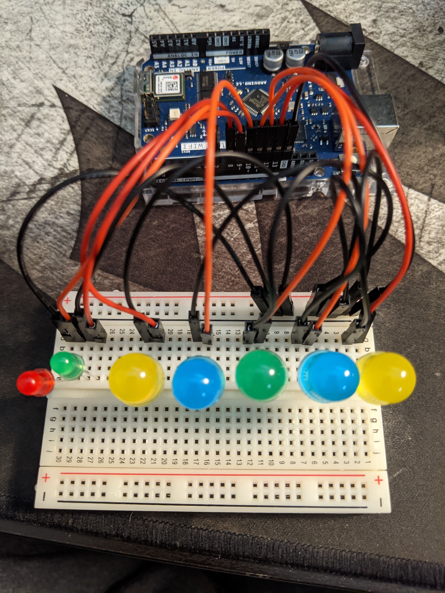
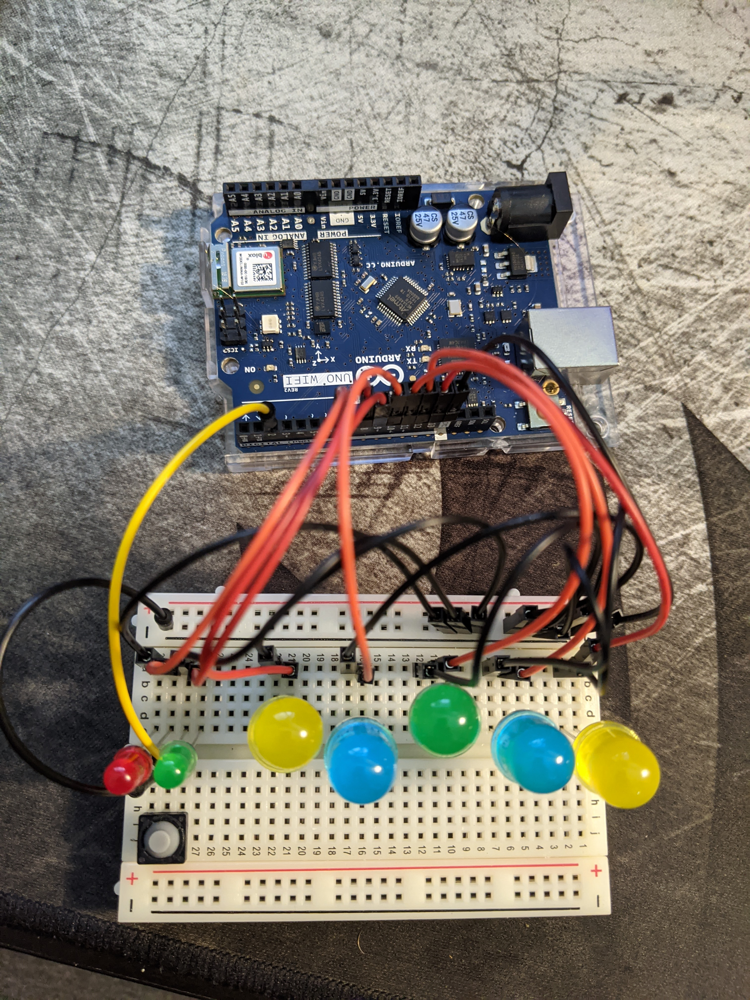

# Light Game
Arduino Light Game sample code repo

## Physical Setup

### Plug In the LEDs

Each LED has a long leg and a short  leg which are positive and common respectivley. Plug the LEDs in to the board (I used row E). Long legs should face right. From right to left, the long legs should go in hole # 1, 6, 11, 16, 21, 27, 29.

### Add power

Internally, breadboards have each numbered row electrically connected, so we can plug our wires into the Digital I/O of the Arduino and the same numbered row as the lights. Connect breadboard slot 1 to DIO pin 13 as shown in the image below.

Repeat this step for DIO pins 12 - 7 for each of the LEDs from the previous step.

### Add Neutral
The breadboard also has power rails running along the long edges. We are going to use the common rail to simplify things. First, use a black wire to connect the GND pin on the Arduino to the right most slot in the row marked with a - sign as shown below. 

Next, Connect black wires to the short legs of the LEDs (positive slot # +1) and to a slot on the common rail, it doesn't really matter which one. To do this, it may actually be easier to remove the LEDs firts then re-install them.
The board should now look something like this:

### The Button

Now that we have our lights powered, the game will run but there's no way to play it. Use a colored wire to connect Arduino pin 2 to breadboard slot (f,28) and add another black wire to connect the common rail to (f,30). Now, connect your buttons' wires to (j,30) and (j,28). Which wire goes where (polarity) does not matter.

### Finished product

When you have finised everything, the assembly should now look like this.

## Software

If you power on the board now, you'll see that the lights do nothing, and that's because we didn't tell them what to do. Open Arduino IDE and open lightgame.ino. Then, plug the USB-B to USB-A cable in to your Arduino and computer. Make sure that it says "Arduino Uno WiFi Rev. 2" in the lower right hand corner. Now, upload the software to the arduino. If it works, the lights will start moving in a bounce pattern. 

### Getting the code

While you can just copy/paste the contents of lightgame.ino into your IDE, it's generally better to use git. You can run the command `git clone https://github.com/HVRHSCode/lightgame` This will create a clone of this repository on your computer. This lets you edit it or more easily get any updates by running `git pull` 